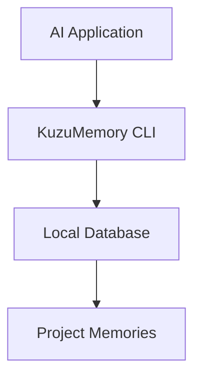
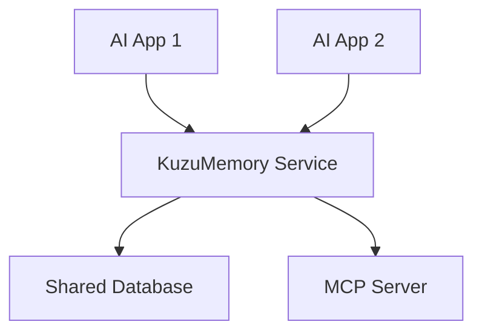
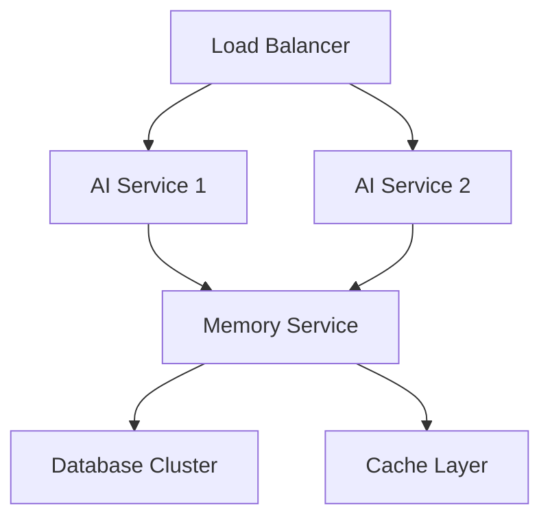

# Deployment Guide

**Production deployment strategies for KuzuMemory-powered AI systems**

---

## 🎯 **Deployment Overview**

KuzuMemory supports various deployment patterns optimized for AI applications:

- **Embedded Deployment** - Direct integration with AI applications
- **Service Architecture** - Standalone memory service
- **Microservices** - Distributed AI system integration
- **Cloud Native** - Kubernetes and container orchestration
- **Edge Deployment** - Resource-constrained environments

---

## 🏗️ **Architecture Patterns**

### **Embedded Deployment**


**Use Cases:**
- Single AI application
- Development environments
- Simple integrations

**Benefits:**
- Lowest latency
- Simple deployment
- No network dependencies

### **Service Architecture**


**Use Cases:**
- Multiple AI applications
- Team collaboration
- Centralized memory management

**Benefits:**
- Shared knowledge base
- Centralized management
- Scalable architecture

### **Microservices Architecture**


**Use Cases:**
- High-scale AI systems
- Multi-tenant applications
- Cloud deployments

**Benefits:**
- High availability
- Horizontal scaling
- Service isolation

---

## 📦 **Container Deployment**

### **Docker Configuration**

#### **Application Container**
```dockerfile
# Dockerfile for AI application with KuzuMemory
FROM python:3.11-slim

# Install system dependencies
RUN apt-get update && apt-get install -y \
    gcc \
    && rm -rf /var/lib/apt/lists/*

# Install Python dependencies
COPY requirements.txt .
RUN pip install --no-cache-dir -r requirements.txt
RUN pip install kuzu-memory

# Create application user
RUN useradd -m -u 1000 appuser
USER appuser

# Set working directory
WORKDIR /app

# Copy application code
COPY --chown=appuser:appuser . .

# Create memory directory
RUN mkdir -p /app/memories

# Initialize KuzuMemory
RUN kuzu-memory init

# Health check
HEALTHCHECK --interval=30s --timeout=10s --start-period=5s \
    CMD kuzu-memory stats --format json > /dev/null || exit 1

# Run application
CMD ["python", "main.py"]
```

#### **Memory Service Container**
```dockerfile
# Dockerfile for standalone memory service
FROM python:3.11-slim

RUN apt-get update && apt-get install -y \
    gcc \
    && rm -rf /var/lib/apt/lists/*

RUN pip install kuzu-memory[mcp]

# Create service user
RUN useradd -m -u 1001 memoryuser
USER memoryuser

WORKDIR /app

# Memory storage volume
VOLUME ["/app/memories"]

# Health check
HEALTHCHECK --interval=30s --timeout=5s \
    CMD curl -f http://localhost:8080/health || exit 1

# Expose MCP server port
EXPOSE 8080

# Run MCP server
CMD ["kuzu-memory", "mcp", "start", "--port", "8080", "--host", "0.0.0.0"]
```

### **Docker Compose Setup**

```yaml
# docker-compose.yml - Complete AI system with memory
version: '3.8'

services:
  ai-app:
    build: .
    ports:
      - "3000:3000"
    environment:
      - KUZU_MEMORY_DB_PATH=/app/memories
      - KUZU_MEMORY_CONFIG=/app/config/kuzu-config.json
      - MEMORY_SERVICE_URL=http://memory-service:8080
    volumes:
      - app-memories:/app/memories
      - ./config:/app/config:ro
    depends_on:
      - memory-service
      - redis
    restart: unless-stopped
    healthcheck:
      test: ["CMD", "curl", "-f", "http://localhost:3000/health"]
      interval: 30s
      timeout: 10s
      retries: 3

  memory-service:
    image: kuzu-memory:latest
    ports:
      - "8080:8080"
    environment:
      - KUZU_MEMORY_DB_PATH=/app/memories
      - KUZU_MEMORY_MCP_HOST=0.0.0.0
      - KUZU_MEMORY_MCP_PORT=8080
    volumes:
      - shared-memories:/app/memories
      - ./memory-config:/app/config:ro
    restart: unless-stopped
    healthcheck:
      test: ["CMD", "curl", "-f", "http://localhost:8080/health"]
      interval: 30s
      timeout: 5s
      retries: 3

  redis:
    image: redis:7-alpine
    ports:
      - "6379:6379"
    volumes:
      - redis-data:/data
    restart: unless-stopped
    healthcheck:
      test: ["CMD", "redis-cli", "ping"]
      interval: 10s
      timeout: 5s
      retries: 3

  nginx:
    image: nginx:alpine
    ports:
      - "80:80"
      - "443:443"
    volumes:
      - ./nginx.conf:/etc/nginx/nginx.conf:ro
      - ./ssl:/etc/nginx/ssl:ro
    depends_on:
      - ai-app
    restart: unless-stopped

volumes:
  app-memories:
    driver: local
  shared-memories:
    driver: local
  redis-data:
    driver: local

networks:
  default:
    driver: bridge
```

### **Configuration Management**

#### **Production Configuration**
```json
{
  "database_path": "/app/memories",
  "performance": {
    "query_timeout_ms": 100,
    "cache_size": 1000,
    "enable_cli_adapter": true,
    "connection_pool_size": 10
  },
  "memory_types": {
    "default_type": "context",
    "retention_policies": {
      "identity": null,
      "preference": null,
      "decision": 90,
      "pattern": 30,
      "solution": 60,
      "status": 6,
      "context": 24
    }
  },
  "security": {
    "max_content_length": 100000,
    "sanitize_input": true,
    "log_queries": false
  },
  "monitoring": {
    "enable_metrics": true,
    "metrics_port": 9090,
    "log_level": "INFO"
  },
  "integration": {
    "async_learning": true,
    "quiet_mode": true,
    "batch_size": 100
  }
}
```

#### **Environment Variables**
```bash
# .env.production
KUZU_MEMORY_DB_PATH=/app/memories
KUZU_MEMORY_CONFIG=/app/config/kuzu-config.json
KUZU_MEMORY_LOG_LEVEL=INFO
KUZU_MEMORY_ENABLE_METRICS=true
KUZU_MEMORY_METRICS_PORT=9090

# Service discovery
MEMORY_SERVICE_URL=http://memory-service:8080
REDIS_URL=redis://redis:6379/0

# Security
KUZU_MEMORY_SANITIZE_INPUT=true
KUZU_MEMORY_MAX_CONTENT_LENGTH=100000

# Performance
KUZU_MEMORY_CACHE_SIZE=1000
KUZU_MEMORY_QUERY_TIMEOUT=100
```

---

## ☸️ **Kubernetes Deployment**

### **Namespace and ConfigMap**
```yaml
# namespace.yaml
apiVersion: v1
kind: Namespace
metadata:
  name: kuzu-memory
---
# configmap.yaml
apiVersion: v1
kind: ConfigMap
metadata:
  name: kuzu-memory-config
  namespace: kuzu-memory
data:
  kuzu-config.json: |
    {
      "database_path": "/app/memories",
      "performance": {
        "query_timeout_ms": 100,
        "cache_size": 1000,
        "enable_cli_adapter": true
      },
      "monitoring": {
        "enable_metrics": true,
        "metrics_port": 9090
      }
    }
  .env: |
    KUZU_MEMORY_LOG_LEVEL=INFO
    KUZU_MEMORY_ENABLE_METRICS=true
```

### **Persistent Storage**
```yaml
# storage.yaml
apiVersion: v1
kind: PersistentVolumeClaim
metadata:
  name: kuzu-memory-storage
  namespace: kuzu-memory
spec:
  accessModes:
    - ReadWriteOnce
  resources:
    requests:
      storage: 10Gi
  storageClassName: fast-ssd
---
# For shared memories across pods
apiVersion: v1
kind: PersistentVolumeClaim
metadata:
  name: kuzu-shared-memories
  namespace: kuzu-memory
spec:
  accessModes:
    - ReadWriteMany
  resources:
    requests:
      storage: 50Gi
  storageClassName: shared-storage
```

### **Memory Service Deployment**
```yaml
# memory-service-deployment.yaml
apiVersion: apps/v1
kind: Deployment
metadata:
  name: kuzu-memory-service
  namespace: kuzu-memory
  labels:
    app: kuzu-memory-service
spec:
  replicas: 3
  selector:
    matchLabels:
      app: kuzu-memory-service
  template:
    metadata:
      labels:
        app: kuzu-memory-service
    spec:
      containers:
      - name: memory-service
        image: kuzu-memory:v1.0.1
        ports:
        - containerPort: 8080
          name: mcp-server
        - containerPort: 9090
          name: metrics
        env:
        - name: KUZU_MEMORY_DB_PATH
          value: "/app/memories"
        - name: KUZU_MEMORY_CONFIG
          value: "/app/config/kuzu-config.json"
        envFrom:
        - configMapRef:
            name: kuzu-memory-config
        volumeMounts:
        - name: memory-storage
          mountPath: /app/memories
        - name: config
          mountPath: /app/config
        resources:
          requests:
            memory: "256Mi"
            cpu: "100m"
          limits:
            memory: "1Gi"
            cpu: "500m"
        livenessProbe:
          httpGet:
            path: /health
            port: 8080
          initialDelaySeconds: 30
          periodSeconds: 30
        readinessProbe:
          httpGet:
            path: /ready
            port: 8080
          initialDelaySeconds: 5
          periodSeconds: 5
      volumes:
      - name: memory-storage
        persistentVolumeClaim:
          claimName: kuzu-shared-memories
      - name: config
        configMap:
          name: kuzu-memory-config
---
# memory-service-service.yaml
apiVersion: v1
kind: Service
metadata:
  name: kuzu-memory-service
  namespace: kuzu-memory
  labels:
    app: kuzu-memory-service
spec:
  selector:
    app: kuzu-memory-service
  ports:
  - name: mcp-server
    port: 8080
    targetPort: 8080
  - name: metrics
    port: 9090
    targetPort: 9090
  type: ClusterIP
```

### **AI Application Deployment**
```yaml
# ai-app-deployment.yaml
apiVersion: apps/v1
kind: Deployment
metadata:
  name: ai-application
  namespace: kuzu-memory
spec:
  replicas: 5
  selector:
    matchLabels:
      app: ai-application
  template:
    metadata:
      labels:
        app: ai-application
    spec:
      containers:
      - name: ai-app
        image: your-ai-app:latest
        ports:
        - containerPort: 3000
        env:
        - name: KUZU_MEMORY_DB_PATH
          value: "/app/memories"
        - name: MEMORY_SERVICE_URL
          value: "http://kuzu-memory-service:8080"
        volumeMounts:
        - name: app-memories
          mountPath: /app/memories
        - name: config
          mountPath: /app/config
        resources:
          requests:
            memory: "512Mi"
            cpu: "200m"
          limits:
            memory: "2Gi"
            cpu: "1000m"
        livenessProbe:
          httpGet:
            path: /health
            port: 3000
          initialDelaySeconds: 30
          periodSeconds: 30
        readinessProbe:
          httpGet:
            path: /ready
            port: 3000
          initialDelaySeconds: 5
          periodSeconds: 10
      initContainers:
      - name: init-memory
        image: kuzu-memory:v1.0.1
        command: ['kuzu-memory', 'init', '--force']
        volumeMounts:
        - name: app-memories
          mountPath: /app/memories
      volumes:
      - name: app-memories
        persistentVolumeClaim:
          claimName: kuzu-memory-storage
      - name: config
        configMap:
          name: kuzu-memory-config
```

### **Horizontal Pod Autoscaler**
```yaml
# hpa.yaml
apiVersion: autoscaling/v2
kind: HorizontalPodAutoscaler
metadata:
  name: ai-app-hpa
  namespace: kuzu-memory
spec:
  scaleTargetRef:
    apiVersion: apps/v1
    kind: Deployment
    name: ai-application
  minReplicas: 3
  maxReplicas: 20
  metrics:
  - type: Resource
    resource:
      name: cpu
      target:
        type: Utilization
        averageUtilization: 70
  - type: Resource
    resource:
      name: memory
      target:
        type: Utilization
        averageUtilization: 80
  - type: Pods
    pods:
      metric:
        name: memory_queries_per_second
      target:
        type: AverageValue
        averageValue: "100"
```

---

## 🌐 **Cloud Platform Deployments**

### **AWS ECS Deployment**
```yaml
# task-definition.json
{
  "family": "kuzu-memory-ai-app",
  "networkMode": "awsvpc",
  "requiresCompatibilities": ["FARGATE"],
  "cpu": "1024",
  "memory": "2048",
  "executionRoleArn": "arn:aws:iam::account:role/ecsTaskExecutionRole",
  "taskRoleArn": "arn:aws:iam::account:role/ecsTaskRole",
  "containerDefinitions": [
    {
      "name": "ai-application",
      "image": "your-account.dkr.ecr.region.amazonaws.com/ai-app:latest",
      "portMappings": [
        {
          "containerPort": 3000,
          "protocol": "tcp"
        }
      ],
      "environment": [
        {
          "name": "KUZU_MEMORY_DB_PATH",
          "value": "/app/memories"
        },
        {
          "name": "MEMORY_SERVICE_URL",
          "value": "http://memory-service:8080"
        }
      ],
      "mountPoints": [
        {
          "sourceVolume": "memory-storage",
          "containerPath": "/app/memories"
        }
      ],
      "healthCheck": {
        "command": [
          "CMD-SHELL",
          "curl -f http://localhost:3000/health || exit 1"
        ],
        "interval": 30,
        "timeout": 5,
        "retries": 3
      },
      "logConfiguration": {
        "logDriver": "awslogs",
        "options": {
          "awslogs-group": "/ecs/kuzu-memory-ai-app",
          "awslogs-region": "us-west-2",
          "awslogs-stream-prefix": "ecs"
        }
      }
    },
    {
      "name": "memory-service",
      "image": "your-account.dkr.ecr.region.amazonaws.com/kuzu-memory:latest",
      "portMappings": [
        {
          "containerPort": 8080,
          "protocol": "tcp"
        }
      ],
      "mountPoints": [
        {
          "sourceVolume": "memory-storage",
          "containerPath": "/app/memories"
        }
      ],
      "healthCheck": {
        "command": [
          "CMD-SHELL",
          "curl -f http://localhost:8080/health || exit 1"
        ]
      }
    }
  ],
  "volumes": [
    {
      "name": "memory-storage",
      "efsVolumeConfiguration": {
        "fileSystemId": "fs-1234567890abcdef0",
        "transitEncryption": "ENABLED"
      }
    }
  ]
}
```

### **Google Cloud Run**
```yaml
# cloudrun-service.yaml
apiVersion: serving.knative.dev/v1
kind: Service
metadata:
  name: kuzu-memory-ai-app
  annotations:
    run.googleapis.com/ingress: all
    run.googleapis.com/execution-environment: gen2
spec:
  template:
    metadata:
      annotations:
        run.googleapis.com/cpu-throttling: "false"
        run.googleapis.com/memory: "2Gi"
        run.googleapis.com/cpu: "2"
        autoscaling.knative.dev/maxScale: "100"
    spec:
      containerConcurrency: 10
      containers:
      - image: gcr.io/your-project/kuzu-memory-ai-app:latest
        ports:
        - containerPort: 3000
        env:
        - name: KUZU_MEMORY_DB_PATH
          value: "/app/memories"
        - name: GOOGLE_CLOUD_PROJECT
          value: "your-project-id"
        resources:
          limits:
            memory: "2Gi"
            cpu: "2"
        volumeMounts:
        - name: memory-storage
          mountPath: /app/memories
      volumes:
      - name: memory-storage
        csi:
          driver: gcsfuse.run.googleapis.com
          volumeAttributes:
            bucketName: "your-memory-bucket"
```

### **Azure Container Instances**
```yaml
# azure-container-group.yaml
apiVersion: '2021-03-01'
location: eastus
name: kuzu-memory-ai-group
properties:
  containers:
  - name: ai-application
    properties:
      image: youracr.azurecr.io/ai-app:latest
      resources:
        requests:
          cpu: 1
          memoryInGb: 2
      ports:
      - port: 3000
        protocol: TCP
      environmentVariables:
      - name: KUZU_MEMORY_DB_PATH
        value: /app/memories
      - name: MEMORY_SERVICE_URL
        value: http://localhost:8080
      volumeMounts:
      - name: memory-storage
        mountPath: /app/memories
  - name: memory-service
    properties:
      image: youracr.azurecr.io/kuzu-memory:latest
      resources:
        requests:
          cpu: 0.5
          memoryInGb: 1
      ports:
      - port: 8080
        protocol: TCP
      volumeMounts:
      - name: memory-storage
        mountPath: /app/memories
  osType: Linux
  restartPolicy: Always
  ipAddress:
    type: Public
    ports:
    - protocol: TCP
      port: 3000
  volumes:
  - name: memory-storage
    azureFile:
      shareName: kuzu-memories
      storageAccountName: yourstorageaccount
      storageAccountKey: your-storage-key
type: Microsoft.ContainerInstance/containerGroups
```

---

## 🔧 **Production Configuration**

### **Performance Tuning**
```json
{
  "performance": {
    "query_timeout_ms": 100,
    "cache_size": 5000,
    "enable_cli_adapter": true,
    "connection_pool_size": 20,
    "batch_size": 100,
    "max_concurrent_queries": 50,
    "query_cache_ttl_seconds": 300
  },
  "database": {
    "checkpoint_interval": 300,
    "wal_autocheckpoint": 1000,
    "cache_size_kb": 10240,
    "temp_store": "memory",
    "synchronous": "NORMAL"
  },
  "memory_management": {
    "cleanup_interval_hours": 24,
    "max_memory_age_days": 90,
    "auto_vacuum": true,
    "max_database_size_gb": 10
  }
}
```

### **Security Configuration**
```json
{
  "security": {
    "sanitize_input": true,
    "max_content_length": 100000,
    "rate_limiting": {
      "requests_per_minute": 1000,
      "burst_size": 100
    },
    "encryption": {
      "encrypt_at_rest": true,
      "encryption_key_rotation_days": 90
    },
    "access_control": {
      "require_api_key": true,
      "allowed_origins": ["https://your-app.com"],
      "log_access": true
    }
  }
}
```

### **Monitoring Configuration**
```json
{
  "monitoring": {
    "enable_metrics": true,
    "metrics_port": 9090,
    "prometheus_endpoint": "/metrics",
    "health_check_endpoint": "/health",
    "log_level": "INFO",
    "structured_logging": true,
    "trace_requests": true,
    "metrics_labels": {
      "service": "kuzu-memory",
      "environment": "production",
      "version": "1.0.1"
    }
  }
}
```

---

## 📊 **Monitoring and Observability**

### **Prometheus Metrics**
```yaml
# prometheus-config.yml
global:
  scrape_interval: 15s

scrape_configs:
- job_name: 'kuzu-memory'
  static_configs:
  - targets: ['kuzu-memory-service:9090']
  metrics_path: /metrics
  scrape_interval: 10s

- job_name: 'ai-application'
  static_configs:
  - targets: ['ai-app:9091']
  metrics_path: /metrics
  scrape_interval: 15s
```

### **Grafana Dashboard**
```json
{
  "dashboard": {
    "id": null,
    "title": "KuzuMemory Metrics",
    "panels": [
      {
        "title": "Memory Query Rate",
        "type": "graph",
        "targets": [
          {
            "expr": "rate(kuzu_memory_queries_total[5m])",
            "legendFormat": "Queries/sec"
          }
        ]
      },
      {
        "title": "Query Response Time",
        "type": "graph",
        "targets": [
          {
            "expr": "histogram_quantile(0.95, kuzu_memory_query_duration_seconds_bucket)",
            "legendFormat": "95th percentile"
          },
          {
            "expr": "histogram_quantile(0.50, kuzu_memory_query_duration_seconds_bucket)",
            "legendFormat": "50th percentile"
          }
        ]
      },
      {
        "title": "Memory Usage",
        "type": "graph",
        "targets": [
          {
            "expr": "kuzu_memory_database_size_bytes",
            "legendFormat": "Database Size"
          },
          {
            "expr": "kuzu_memory_count",
            "legendFormat": "Memory Count"
          }
        ]
      }
    ]
  }
}
```

### **Alert Rules**
```yaml
# alerting-rules.yml
groups:
- name: kuzu-memory
  rules:
  - alert: HighMemoryQueryLatency
    expr: histogram_quantile(0.95, kuzu_memory_query_duration_seconds_bucket) > 0.1
    for: 5m
    labels:
      severity: warning
    annotations:
      summary: "High memory query latency"
      description: "95th percentile query latency is {{ $value }}s"

  - alert: MemoryServiceDown
    expr: up{job="kuzu-memory"} == 0
    for: 1m
    labels:
      severity: critical
    annotations:
      summary: "Memory service is down"
      description: "Memory service has been down for more than 1 minute"

  - alert: DatabaseSizeGrowth
    expr: increase(kuzu_memory_database_size_bytes[24h]) > 1e9
    for: 5m
    labels:
      severity: warning
    annotations:
      summary: "Rapid database growth"
      description: "Database size increased by {{ $value | humanize1024 }}B in 24h"
```

### **Application Logging**
```python
# logging-config.py
import logging
import json
from datetime import datetime

class StructuredFormatter(logging.Formatter):
    def format(self, record):
        log_obj = {
            'timestamp': datetime.utcnow().isoformat(),
            'level': record.levelname,
            'logger': record.name,
            'message': record.getMessage(),
            'module': record.module,
            'function': record.funcName,
            'line': record.lineno
        }

        if hasattr(record, 'memory_operation'):
            log_obj['memory_operation'] = record.memory_operation
        if hasattr(record, 'execution_time_ms'):
            log_obj['execution_time_ms'] = record.execution_time_ms
        if hasattr(record, 'memory_count'):
            log_obj['memory_count'] = record.memory_count

        return json.dumps(log_obj)

# Configure logging
logging.basicConfig(
    level=logging.INFO,
    handlers=[logging.StreamHandler()],
    format='%(message)s'
)

# Use structured logging
logger = logging.getLogger(__name__)
logger.handlers[0].setFormatter(StructuredFormatter())

# Example usage
logger.info("Memory query completed", extra={
    'memory_operation': 'enhance_prompt',
    'execution_time_ms': 45,
    'memory_count': 3
})
```

---

## 🚀 **Deployment Automation**

### **CI/CD Pipeline**
```yaml
# .github/workflows/deploy.yml
name: Deploy to Production

on:
  push:
    branches: [main]
    tags: ['v*']

jobs:
  test:
    runs-on: ubuntu-latest
    steps:
    - uses: actions/checkout@v4
    - name: Run tests
      run: |
        pip install -e .[dev]
        pytest tests/ --cov

  build:
    needs: test
    runs-on: ubuntu-latest
    steps:
    - uses: actions/checkout@v4

    - name: Build Docker image
      run: |
        docker build -t kuzu-memory:${{ github.sha }} .
        docker tag kuzu-memory:${{ github.sha }} kuzu-memory:latest

    - name: Push to registry
      run: |
        echo ${{ secrets.REGISTRY_PASSWORD }} | docker login -u ${{ secrets.REGISTRY_USERNAME }} --password-stdin
        docker push kuzu-memory:${{ github.sha }}
        docker push kuzu-memory:latest

  deploy:
    needs: build
    runs-on: ubuntu-latest
    if: github.ref == 'refs/heads/main'
    steps:
    - name: Deploy to Kubernetes
      run: |
        kubectl set image deployment/kuzu-memory-service memory-service=kuzu-memory:${{ github.sha }}
        kubectl rollout status deployment/kuzu-memory-service
        kubectl set image deployment/ai-application ai-app=your-ai-app:${{ github.sha }}
        kubectl rollout status deployment/ai-application
```

### **Helm Chart**
```yaml
# Chart.yaml
apiVersion: v2
name: kuzu-memory
description: KuzuMemory AI system deployment
version: 1.0.0
appVersion: 1.0.1

# values.yaml
global:
  imageRegistry: your-registry.com
  imagePullSecrets: []

memoryService:
  replicaCount: 3
  image:
    repository: kuzu-memory
    tag: "1.0.1"
    pullPolicy: IfNotPresent

  service:
    type: ClusterIP
    port: 8080
    metricsPort: 9090

  resources:
    requests:
      cpu: 100m
      memory: 256Mi
    limits:
      cpu: 500m
      memory: 1Gi

  persistence:
    enabled: true
    storageClass: "fast-ssd"
    size: 10Gi

aiApplication:
  replicaCount: 5
  image:
    repository: your-ai-app
    tag: "latest"
    pullPolicy: Always

  service:
    type: LoadBalancer
    port: 80
    targetPort: 3000

  autoscaling:
    enabled: true
    minReplicas: 3
    maxReplicas: 20
    targetCPUUtilizationPercentage: 70

monitoring:
  prometheus:
    enabled: true
    serviceMonitor:
      enabled: true
  grafana:
    enabled: true
    dashboards:
      enabled: true

# templates/deployment.yaml (excerpt)
apiVersion: apps/v1
kind: Deployment
metadata:
  name: {{ include "kuzu-memory.fullname" . }}-memory-service
spec:
  replicas: {{ .Values.memoryService.replicaCount }}
  selector:
    matchLabels:
      {{- include "kuzu-memory.selectorLabels" . | nindent 6 }}
      component: memory-service
  template:
    metadata:
      labels:
        {{- include "kuzu-memory.selectorLabels" . | nindent 8 }}
        component: memory-service
    spec:
      containers:
      - name: memory-service
        image: "{{ .Values.global.imageRegistry }}/{{ .Values.memoryService.image.repository }}:{{ .Values.memoryService.image.tag }}"
        imagePullPolicy: {{ .Values.memoryService.image.pullPolicy }}
        ports:
        - name: mcp-server
          containerPort: 8080
        - name: metrics
          containerPort: 9090
        resources:
          {{- toYaml .Values.memoryService.resources | nindent 12 }}
```

### **Terraform Infrastructure**
```hcl
# main.tf
provider "kubernetes" {
  config_path = "~/.kube/config"
}

provider "helm" {
  kubernetes {
    config_path = "~/.kube/config"
  }
}

# EKS Cluster
module "eks" {
  source = "terraform-aws-modules/eks/aws"
  version = "~> 18.0"

  cluster_name    = "kuzu-memory-cluster"
  cluster_version = "1.21"

  vpc_id     = module.vpc.vpc_id
  subnet_ids = module.vpc.private_subnets

  node_groups = {
    memory_nodes = {
      instance_types = ["t3.medium"]
      min_capacity   = 3
      max_capacity   = 20
      desired_capacity = 5
    }
  }
}

# EFS for shared storage
resource "aws_efs_file_system" "kuzu_memory_storage" {
  creation_token = "kuzu-memory-storage"

  tags = {
    Name = "KuzuMemory Storage"
  }
}

# Helm deployment
resource "helm_release" "kuzu_memory" {
  name       = "kuzu-memory"
  chart      = "./helm/kuzu-memory"
  namespace  = "kuzu-memory"
  create_namespace = true

  values = [
    file("${path.module}/helm-values.yaml")
  ]

  depends_on = [module.eks]
}
```

---

## 🔒 **Security Best Practices**

### **Network Security**
```yaml
# network-policy.yaml
apiVersion: networking.k8s.io/v1
kind: NetworkPolicy
metadata:
  name: kuzu-memory-network-policy
  namespace: kuzu-memory
spec:
  podSelector:
    matchLabels:
      app: kuzu-memory-service
  policyTypes:
  - Ingress
  - Egress
  ingress:
  - from:
    - podSelector:
        matchLabels:
          app: ai-application
    ports:
    - protocol: TCP
      port: 8080
  egress:
  - to: []
    ports:
    - protocol: TCP
      port: 53
    - protocol: UDP
      port: 53
```

### **RBAC Configuration**
```yaml
# rbac.yaml
apiVersion: v1
kind: ServiceAccount
metadata:
  name: kuzu-memory-sa
  namespace: kuzu-memory
---
apiVersion: rbac.authorization.k8s.io/v1
kind: Role
metadata:
  name: kuzu-memory-role
  namespace: kuzu-memory
rules:
- apiGroups: [""]
  resources: ["pods", "services", "configmaps", "secrets"]
  verbs: ["get", "list", "watch"]
---
apiVersion: rbac.authorization.k8s.io/v1
kind: RoleBinding
metadata:
  name: kuzu-memory-rolebinding
  namespace: kuzu-memory
subjects:
- kind: ServiceAccount
  name: kuzu-memory-sa
  namespace: kuzu-memory
roleRef:
  kind: Role
  name: kuzu-memory-role
  apiGroup: rbac.authorization.k8s.io
```

### **Secret Management**
```yaml
# secrets.yaml
apiVersion: v1
kind: Secret
metadata:
  name: kuzu-memory-secrets
  namespace: kuzu-memory
type: Opaque
data:
  api-key: <base64-encoded-api-key>
  encryption-key: <base64-encoded-encryption-key>
  database-password: <base64-encoded-db-password>
---
# Using external secrets operator
apiVersion: external-secrets.io/v1beta1
kind: ExternalSecret
metadata:
  name: kuzu-memory-external-secrets
  namespace: kuzu-memory
spec:
  refreshInterval: 1h
  secretStoreRef:
    name: aws-secrets-manager
    kind: SecretStore
  target:
    name: kuzu-memory-secrets
    creationPolicy: Owner
  data:
  - secretKey: api-key
    remoteRef:
      key: kuzu-memory/api-key
  - secretKey: encryption-key
    remoteRef:
      key: kuzu-memory/encryption-key
```

---

## 📈 **Scaling Strategies**

### **Horizontal Scaling**
```yaml
# Custom Metrics Scaler
apiVersion: autoscaling/v2
kind: HorizontalPodAutoscaler
metadata:
  name: kuzu-memory-hpa
spec:
  scaleTargetRef:
    apiVersion: apps/v1
    kind: Deployment
    name: kuzu-memory-service
  minReplicas: 3
  maxReplicas: 50
  metrics:
  - type: Resource
    resource:
      name: cpu
      target:
        type: Utilization
        averageUtilization: 70
  - type: Pods
    pods:
      metric:
        name: memory_queries_per_second
      target:
        type: AverageValue
        averageValue: "100"
  behavior:
    scaleDown:
      stabilizationWindowSeconds: 300
      policies:
      - type: Percent
        value: 50
        periodSeconds: 60
    scaleUp:
      stabilizationWindowSeconds: 60
      policies:
      - type: Percent
        value: 100
        periodSeconds: 60
```

### **Database Sharding**
```python
# database-sharding.py
class ShardedMemorySystem:
    def __init__(self, shard_count: int = 4):
        self.shards = []
        for i in range(shard_count):
            shard = KuzuMemory(db_path=f"/app/memories/shard_{i}")
            self.shards.append(shard)

    def get_shard(self, content: str) -> KuzuMemory:
        # Simple hash-based sharding
        shard_id = hash(content) % len(self.shards)
        return self.shards[shard_id]

    async def query_memories(self, query: str):
        # Query all shards and merge results
        tasks = [shard.query_memories(query) for shard in self.shards]
        results = await asyncio.gather(*tasks)

        # Merge and rank results
        all_memories = []
        for shard_results in results:
            all_memories.extend(shard_results)

        # Sort by relevance and return top results
        return sorted(all_memories, key=lambda m: m.relevance, reverse=True)[:10]
```

---

## 🎯 **Deployment Checklist**

### **Pre-Deployment**
- [ ] Run full test suite
- [ ] Performance benchmarks pass
- [ ] Security scan completed
- [ ] Configuration validated
- [ ] Backup strategy in place
- [ ] Monitoring configured
- [ ] Rollback plan prepared

### **Production Deployment**
- [ ] Blue-green deployment ready
- [ ] Health checks configured
- [ ] Auto-scaling policies set
- [ ] Network policies applied
- [ ] SSL certificates installed
- [ ] Logging aggregation working
- [ ] Metrics collection active

### **Post-Deployment**
- [ ] Health checks passing
- [ ] Performance metrics normal
- [ ] Error rates acceptable
- [ ] User acceptance testing
- [ ] Documentation updated
- [ ] Team notifications sent
- [ ] Monitoring alerts active

**Complete deployment guide for production KuzuMemory systems!** 🚀🔧