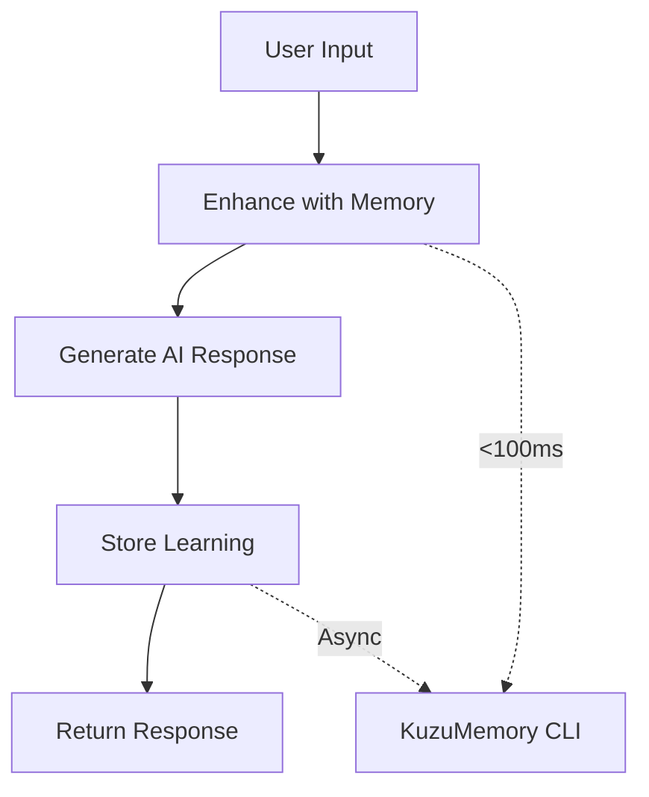

# Integration Guide

**Comprehensive guide for integrating KuzuMemory with AI systems and applications**

---

## 🎯 **Integration Overview**

KuzuMemory is designed for universal integration with AI systems through its CLI-first approach. This guide covers:

- **Universal Integration Pattern** - Works with any AI system
- **Language-Specific Examples** - Python, JavaScript, Go, Rust, etc.
- **Production Best Practices** - Error handling, monitoring, scaling
- **Performance Optimization** - Caching, async operations, tuning
- **Advanced Patterns** - Complex workflows and custom integrations

---

## 🧠 **Core Integration Pattern**

All KuzuMemory integrations follow the same pattern:



### **Basic Integration Steps**
1. **Enhance**: Add context from memories to user prompts
2. **Generate**: Use your AI system to generate responses
3. **Learn**: Store the interaction for future use (async)
4. **Monitor**: Track performance and memory usage

---

## 🐍 **Python Integration**

### **Simple Integration**
```python
import subprocess
import json
from typing import Optional, Dict, Any

class SimpleMemoryIntegration:
    """Basic KuzuMemory integration for Python AI systems."""

    def __init__(self, timeout: int = 5):
        self.timeout = timeout

    def enhance_prompt(self, prompt: str) -> str:
        """Enhance prompt with memories."""
        try:
            result = subprocess.run([
                'kuzu-memory', 'enhance', prompt, '--format', 'plain'
            ], capture_output=True, text=True, timeout=self.timeout)

            return result.stdout.strip() if result.returncode == 0 else prompt
        except subprocess.TimeoutExpired:
            return prompt  # Fallback to original

    def store_learning(self, content: str, source: str = "python-ai"):
        """Store learning asynchronously."""
        subprocess.run([
            'kuzu-memory', 'learn', content,
            '--source', source, '--quiet'
        ], check=False)  # Fire and forget

# Usage example
memory = SimpleMemoryIntegration()

# In your AI chat loop
user_input = "How do I implement authentication?"
enhanced_prompt = memory.enhance_prompt(user_input)
ai_response = your_ai_system.generate(enhanced_prompt)
memory.store_learning(f"Q: {user_input}\\nA: {ai_response}")
```

### **Production-Ready Integration**
```python
import subprocess
import json
import logging
import asyncio
from typing import Optional, Dict, Any, List
from dataclasses import dataclass
from contextlib import asynccontextmanager

logger = logging.getLogger(__name__)

@dataclass
class MemoryResult:
    """Structured memory operation result."""
    success: bool
    data: Optional[Dict[str, Any]] = None
    error: Optional[str] = None
    execution_time_ms: Optional[float] = None

class ProductionMemoryClient:
    """Production-ready KuzuMemory client with full error handling."""

    def __init__(
        self,
        timeout: int = 5,
        max_retries: int = 2,
        enable_monitoring: bool = True
    ):
        self.timeout = timeout
        self.max_retries = max_retries
        self.enable_monitoring = enable_monitoring
        self._stats = {"queries": 0, "errors": 0, "cache_hits": 0}

        # Verify installation
        self._verify_installation()

        # Initialize monitoring
        if self.enable_monitoring:
            asyncio.create_task(self._monitor_performance())

    def _verify_installation(self) -> None:
        """Verify KuzuMemory CLI is available."""
        try:
            subprocess.run(['kuzu-memory', '--version'],
                         check=True, capture_output=True, timeout=2)
        except (subprocess.CalledProcessError, FileNotFoundError):
            raise RuntimeError("KuzuMemory not installed. Run: pip install kuzu-memory")

    async def enhance_prompt(
        self,
        prompt: str,
        format_type: str = "plain",
        min_relevance: float = 0.3,
        memory_types: Optional[List[str]] = None
    ) -> MemoryResult:
        """Enhanced prompt generation with full error handling."""
        start_time = asyncio.get_event_loop().time()

        for attempt in range(self.max_retries + 1):
            try:
                cmd = [
                    'kuzu-memory', 'enhance', prompt,
                    '--format', format_type,
                    '--min-relevance', str(min_relevance)
                ]

                if memory_types:
                    cmd.extend(['--memory-types', ','.join(memory_types)])

                result = await asyncio.create_subprocess_exec(
                    *cmd,
                    stdout=asyncio.subprocess.PIPE,
                    stderr=asyncio.subprocess.PIPE
                )

                stdout, stderr = await asyncio.wait_for(
                    result.communicate(), timeout=self.timeout
                )

                execution_time = (asyncio.get_event_loop().time() - start_time) * 1000

                if result.returncode == 0:
                    self._stats["queries"] += 1

                    if format_type == "json":
                        data = json.loads(stdout.decode())
                        return MemoryResult(
                            success=True,
                            data=data,
                            execution_time_ms=execution_time
                        )
                    else:
                        return MemoryResult(
                            success=True,
                            data={"enhanced_prompt": stdout.decode().strip()},
                            execution_time_ms=execution_time
                        )
                else:
                    error_msg = stderr.decode()
                    logger.warning(f"Memory enhance failed (attempt {attempt + 1}): {error_msg}")

                    if attempt == self.max_retries:
                        self._stats["errors"] += 1
                        return MemoryResult(
                            success=False,
                            error=error_msg,
                            execution_time_ms=execution_time
                        )

            except asyncio.TimeoutError:
                logger.warning(f"Memory enhance timeout (attempt {attempt + 1})")
                if attempt == self.max_retries:
                    self._stats["errors"] += 1
                    return MemoryResult(
                        success=False,
                        error="Operation timed out",
                        execution_time_ms=self.timeout * 1000
                    )

            # Exponential backoff
            if attempt < self.max_retries:
                await asyncio.sleep(0.1 * (2 ** attempt))

        return MemoryResult(success=False, error="Max retries exceeded")

    async def store_memory(
        self,
        content: str,
        memory_type: str = "context",
        source: str = "python-ai",
        importance: Optional[float] = None,
        expires_in: Optional[str] = None
    ) -> MemoryResult:
        """Store memory with comprehensive options."""
        try:
            cmd = [
                'kuzu-memory', 'learn', content,
                '--source', source,
                '--memory-type', memory_type,
                '--quiet'
            ]

            if importance is not None:
                cmd.extend(['--importance', str(importance)])

            if expires_in:
                cmd.extend(['--expires-in', expires_in])

            # Use asyncio for non-blocking execution
            process = await asyncio.create_subprocess_exec(
                *cmd,
                stdout=asyncio.subprocess.PIPE,
                stderr=asyncio.subprocess.PIPE
            )

            # Don't wait for completion in async mode
            return MemoryResult(success=True)

        except Exception as e:
            logger.error(f"Memory storage failed: {e}")
            return MemoryResult(success=False, error=str(e))

    async def get_stats(self) -> MemoryResult:
        """Get system statistics."""
        try:
            result = await asyncio.create_subprocess_exec(
                'kuzu-memory', 'stats', '--format', 'json',
                stdout=asyncio.subprocess.PIPE,
                stderr=asyncio.subprocess.PIPE
            )

            stdout, stderr = await asyncio.wait_for(
                result.communicate(), timeout=self.timeout
            )

            if result.returncode == 0:
                stats = json.loads(stdout.decode())
                stats.update({"client_stats": self._stats})
                return MemoryResult(success=True, data=stats)
            else:
                return MemoryResult(success=False, error=stderr.decode())

        except Exception as e:
            return MemoryResult(success=False, error=str(e))

    async def _monitor_performance(self):
        """Background monitoring task."""
        while True:
            try:
                await asyncio.sleep(60)  # Monitor every minute
                stats_result = await self.get_stats()

                if stats_result.success and stats_result.data:
                    avg_query_time = stats_result.data.get('performance', {}).get('avg_query_time_ms', 0)
                    if avg_query_time > 100:  # Performance threshold
                        logger.warning(f"Memory queries slow: {avg_query_time}ms average")

            except Exception as e:
                logger.error(f"Performance monitoring error: {e}")

# Usage example
async def ai_chat_with_memory():
    memory_client = ProductionMemoryClient()

    user_input = "How should I handle database connections?"

    # Enhance prompt
    enhance_result = await memory_client.enhance_prompt(
        user_input,
        format_type="json",
        memory_types=["decision", "pattern", "solution"]
    )

    if enhance_result.success:
        enhanced_prompt = enhance_result.data["enhanced_prompt"]
        logger.info(f"Enhanced prompt in {enhance_result.execution_time_ms}ms")
    else:
        enhanced_prompt = user_input
        logger.warning(f"Memory enhancement failed: {enhance_result.error}")

    # Generate AI response (your AI system here)
    ai_response = await your_ai_system.generate(enhanced_prompt)

    # Store interaction
    interaction = f"Human: {user_input}\\nAssistant: {ai_response}"
    await memory_client.store_memory(
        interaction,
        memory_type="context",
        source="chat-session"
    )

    return ai_response
```

### **Framework-Specific Integration**

#### **FastAPI Integration**
```python
from fastapi import FastAPI, HTTPException, BackgroundTasks
from pydantic import BaseModel

app = FastAPI()
memory_client = ProductionMemoryClient()

class ChatRequest(BaseModel):
    message: str
    session_id: str

class ChatResponse(BaseModel):
    response: str
    context_used: bool
    execution_time_ms: float

@app.post("/chat", response_model=ChatResponse)
async def chat_endpoint(request: ChatRequest, background_tasks: BackgroundTasks):
    """Chat endpoint with memory enhancement."""

    # Enhance with memories
    enhance_result = await memory_client.enhance_prompt(
        request.message,
        format_type="json"
    )

    if enhance_result.success:
        enhanced_prompt = enhance_result.data["enhanced_prompt"]
        context_used = len(enhance_result.data.get("memories_used", [])) > 0
        execution_time = enhance_result.execution_time_ms
    else:
        enhanced_prompt = request.message
        context_used = False
        execution_time = 0

    # Generate AI response
    ai_response = await your_ai_generate(enhanced_prompt)

    # Store learning in background
    background_tasks.add_task(
        store_interaction,
        request.message,
        ai_response,
        request.session_id
    )

    return ChatResponse(
        response=ai_response,
        context_used=context_used,
        execution_time_ms=execution_time
    )

async def store_interaction(user_msg: str, ai_response: str, session_id: str):
    """Background task to store interaction."""
    interaction = f"Session {session_id}\\nHuman: {user_msg}\\nAI: {ai_response}"
    await memory_client.store_memory(
        interaction,
        source=f"session-{session_id}"
    )
```

---

## 🌐 **JavaScript/Node.js Integration**

### **Basic Node.js Integration**
```javascript
const { spawn, execSync } = require('child_process');
const { promisify } = require('util');

class KuzuMemoryClient {
    constructor(timeout = 5000) {
        this.timeout = timeout;
        this.verifyInstallation();
    }

    verifyInstallation() {
        try {
            execSync('kuzu-memory --version', { timeout: 2000 });
        } catch (error) {
            throw new Error('KuzuMemory not installed. Run: pip install kuzu-memory');
        }
    }

    async enhancePrompt(prompt, format = 'plain') {
        return new Promise((resolve, reject) => {
            const process = spawn('kuzu-memory', [
                'enhance', prompt, '--format', format
            ]);

            let stdout = '';
            let stderr = '';

            process.stdout.on('data', (data) => {
                stdout += data.toString();
            });

            process.stderr.on('data', (data) => {
                stderr += data.toString();
            });

            const timeout = setTimeout(() => {
                process.kill();
                reject(new Error('Operation timed out'));
            }, this.timeout);

            process.on('close', (code) => {
                clearTimeout(timeout);
                if (code === 0) {
                    resolve(format === 'json' ? JSON.parse(stdout) : stdout.trim());
                } else {
                    reject(new Error(`Memory enhance failed: ${stderr}`));
                }
            });
        });
    }

    async storeMemory(content, options = {}) {
        const {
            source = 'nodejs-ai',
            memoryType = 'context',
            importance,
            expiresIn
        } = options;

        const args = [
            'learn', content,
            '--source', source,
            '--memory-type', memoryType,
            '--quiet'
        ];

        if (importance !== undefined) {
            args.push('--importance', importance.toString());
        }

        if (expiresIn) {
            args.push('--expires-in', expiresIn);
        }

        // Fire and forget for async learning
        spawn('kuzu-memory', args, { detached: true, stdio: 'ignore' }).unref();
        return true;
    }

    async getStats() {
        try {
            const result = await this.enhancePrompt('', 'json');
            // Parse stats from CLI
            return result;
        } catch (error) {
            console.warn('Failed to get stats:', error.message);
            return null;
        }
    }
}

// Usage example
async function chatWithMemory(userInput) {
    const memory = new KuzuMemoryClient();

    try {
        // Enhance prompt
        const enhanced = await memory.enhancePrompt(userInput, 'json');
        const promptToUse = enhanced.enhanced_prompt || userInput;

        // Generate AI response (your AI system)
        const aiResponse = await yourAISystem.generate(promptToUse);

        // Store interaction
        await memory.storeMemory(
            `Q: ${userInput}\\nA: ${aiResponse}`,
            { source: 'chat-session' }
        );

        return {
            response: aiResponse,
            contextUsed: enhanced.memories_used?.length > 0,
            executionTime: enhanced.metadata?.query_time_ms
        };
    } catch (error) {
        console.error('Memory operation failed:', error);
        // Fallback to direct AI generation
        const aiResponse = await yourAISystem.generate(userInput);
        return { response: aiResponse, contextUsed: false };
    }
}

module.exports = { KuzuMemoryClient, chatWithMemory };
```

### **Express.js Integration**
```javascript
const express = require('express');
const { KuzuMemoryClient } = require('./kuzu-memory-client');

const app = express();
const memory = new KuzuMemoryClient();

app.use(express.json());

app.post('/api/chat', async (req, res) => {
    try {
        const { message, sessionId } = req.body;
        const result = await chatWithMemory(message);

        // Store session context in background
        setImmediate(() => {
            memory.storeMemory(
                `Session ${sessionId}: ${message}`,
                { source: `session-${sessionId}` }
            );
        });

        res.json(result);
    } catch (error) {
        console.error('Chat error:', error);
        res.status(500).json({ error: 'Internal server error' });
    }
});

app.listen(3000, () => {
    console.log('AI chat server running on port 3000');
});
```

---

## 🦀 **Rust Integration**

```rust
use std::process::{Command, Stdio};
use std::time::{Duration, Instant};
use serde_json::{Value, from_str};
use tokio::time::timeout;

pub struct KuzuMemoryClient {
    timeout: Duration,
}

impl KuzuMemoryClient {
    pub fn new(timeout_secs: u64) -> Result<Self, Box<dyn std::error::Error>> {
        // Verify installation
        Command::new("kuzu-memory")
            .arg("--version")
            .output()?;

        Ok(KuzuMemoryClient {
            timeout: Duration::from_secs(timeout_secs),
        })
    }

    pub async fn enhance_prompt(&self, prompt: &str) -> Result<String, Box<dyn std::error::Error>> {
        let start = Instant::now();

        let output = timeout(
            self.timeout,
            tokio::process::Command::new("kuzu-memory")
                .args(&["enhance", prompt, "--format", "plain"])
                .output()
        ).await??;

        if output.status.success() {
            let result = String::from_utf8(output.stdout)?;
            println!("Memory enhance took: {:?}", start.elapsed());
            Ok(result.trim().to_string())
        } else {
            let error = String::from_utf8_lossy(&output.stderr);
            Err(format!("Memory enhance failed: {}", error).into())
        }
    }

    pub async fn store_memory(&self, content: &str, source: &str) -> Result<(), Box<dyn std::error::Error>> {
        // Fire and forget async learning
        tokio::spawn(async move {
            let _ = Command::new("kuzu-memory")
                .args(&["learn", content, "--source", source, "--quiet"])
                .stdout(Stdio::null())
                .stderr(Stdio::null())
                .spawn();
        });

        Ok(())
    }

    pub async fn get_stats(&self) -> Result<Value, Box<dyn std::error::Error>> {
        let output = timeout(
            self.timeout,
            tokio::process::Command::new("kuzu-memory")
                .args(&["stats", "--format", "json"])
                .output()
        ).await??;

        if output.status.success() {
            let result = String::from_utf8(output.stdout)?;
            let stats: Value = from_str(&result)?;
            Ok(stats)
        } else {
            Err("Failed to get stats".into())
        }
    }
}

// Usage example
#[tokio::main]
async fn main() -> Result<(), Box<dyn std::error::Error>> {
    let memory = KuzuMemoryClient::new(5)?;

    // Chat loop
    let user_input = "How do I handle concurrent requests?";

    // Enhance prompt
    let enhanced_prompt = match memory.enhance_prompt(user_input).await {
        Ok(enhanced) => enhanced,
        Err(e) => {
            eprintln!("Memory enhancement failed: {}", e);
            user_input.to_string()
        }
    };

    // Generate AI response (your AI system)
    let ai_response = generate_ai_response(&enhanced_prompt).await?;

    // Store learning
    let interaction = format!("Q: {}\\nA: {}", user_input, ai_response);
    memory.store_memory(&interaction, "rust-ai").await?;

    println!("Response: {}", ai_response);
    Ok(())
}

async fn generate_ai_response(prompt: &str) -> Result<String, Box<dyn std::error::Error>> {
    // Your AI system integration here
    Ok(format!("AI response to: {}", prompt))
}
```

---

## 🚀 **Go Integration**

```go
package main

import (
    "bytes"
    "context"
    "encoding/json"
    "fmt"
    "os/exec"
    "time"
)

type KuzuMemoryClient struct {
    timeout time.Duration
}

type MemoryResult struct {
    Success       bool              `json:"success"`
    Data          map[string]interface{} `json:"data,omitempty"`
    Error         string            `json:"error,omitempty"`
    ExecutionTime time.Duration     `json:"execution_time_ms"`
}

func NewKuzuMemoryClient(timeout time.Duration) (*KuzuMemoryClient, error) {
    // Verify installation
    ctx, cancel := context.WithTimeout(context.Background(), 2*time.Second)
    defer cancel()

    if err := exec.CommandContext(ctx, "kuzu-memory", "--version").Run(); err != nil {
        return nil, fmt.Errorf("KuzuMemory not installed: %w", err)
    }

    return &KuzuMemoryClient{timeout: timeout}, nil
}

func (c *KuzuMemoryClient) EnhancePrompt(prompt, format string) (*MemoryResult, error) {
    start := time.Now()

    ctx, cancel := context.WithTimeout(context.Background(), c.timeout)
    defer cancel()

    cmd := exec.CommandContext(ctx, "kuzu-memory", "enhance", prompt, "--format", format)
    var stdout, stderr bytes.Buffer
    cmd.Stdout = &stdout
    cmd.Stderr = &stderr

    err := cmd.Run()
    executionTime := time.Since(start)

    if err != nil {
        return &MemoryResult{
            Success:       false,
            Error:         stderr.String(),
            ExecutionTime: executionTime,
        }, nil
    }

    var data map[string]interface{}
    if format == "json" {
        if err := json.Unmarshal(stdout.Bytes(), &data); err != nil {
            return &MemoryResult{
                Success:       false,
                Error:         fmt.Sprintf("JSON parse error: %v", err),
                ExecutionTime: executionTime,
            }, nil
        }
    } else {
        data = map[string]interface{}{
            "enhanced_prompt": stdout.String(),
        }
    }

    return &MemoryResult{
        Success:       true,
        Data:          data,
        ExecutionTime: executionTime,
    }, nil
}

func (c *KuzuMemoryClient) StoreMemory(content, source, memoryType string) error {
    // Fire and forget async learning
    go func() {
        ctx, cancel := context.WithTimeout(context.Background(), c.timeout)
        defer cancel()

        cmd := exec.CommandContext(ctx, "kuzu-memory", "learn", content,
            "--source", source, "--memory-type", memoryType, "--quiet")
        _ = cmd.Run() // Ignore errors in background
    }()

    return nil
}

func (c *KuzuMemoryClient) GetStats() (*MemoryResult, error) {
    ctx, cancel := context.WithTimeout(context.Background(), c.timeout)
    defer cancel()

    cmd := exec.CommandContext(ctx, "kuzu-memory", "stats", "--format", "json")
    var stdout, stderr bytes.Buffer
    cmd.Stdout = &stdout
    cmd.Stderr = &stderr

    if err := cmd.Run(); err != nil {
        return &MemoryResult{
            Success: false,
            Error:   stderr.String(),
        }, nil
    }

    var data map[string]interface{}
    if err := json.Unmarshal(stdout.Bytes(), &data); err != nil {
        return &MemoryResult{
            Success: false,
            Error:   fmt.Sprintf("JSON parse error: %v", err),
        }, nil
    }

    return &MemoryResult{Success: true, Data: data}, nil
}

// Usage example
func main() {
    client, err := NewKuzuMemoryClient(5 * time.Second)
    if err != nil {
        panic(err)
    }

    userInput := "How do I optimize database queries?"

    // Enhance prompt
    result, err := client.EnhancePrompt(userInput, "json")
    if err != nil {
        fmt.Printf("Memory error: %v\\n", err)
        return
    }

    var promptToUse string
    if result.Success {
        promptToUse = result.Data["enhanced_prompt"].(string)
        fmt.Printf("Enhanced in %v\\n", result.ExecutionTime)
    } else {
        promptToUse = userInput
        fmt.Printf("Enhancement failed: %s\\n", result.Error)
    }

    // Generate AI response (your AI system)
    aiResponse := generateAIResponse(promptToUse)

    // Store interaction
    interaction := fmt.Sprintf("Q: %s\\nA: %s", userInput, aiResponse)
    if err := client.StoreMemory(interaction, "go-ai", "context"); err != nil {
        fmt.Printf("Failed to store memory: %v\\n", err)
    }

    fmt.Printf("Response: %s\\n", aiResponse)
}

func generateAIResponse(prompt string) string {
    // Your AI system integration
    return "AI response to: " + prompt
}
```

---

## 🏗️ **Production Deployment Patterns**

### **Microservices Architecture**
```yaml
# docker-compose.yml
version: '3.8'
services:
  ai-service:
    build: .
    environment:
      - KUZU_MEMORY_DB_PATH=/app/memories
      - KUZU_MEMORY_CONFIG=/app/config/kuzu-config.json
    volumes:
      - ./memories:/app/memories
      - ./config:/app/config
    depends_on:
      - memory-service

  memory-service:
    image: kuzu-memory:latest
    ports:
      - "8080:8080"
    volumes:
      - ./shared-memories:/app/memories
    command: kuzu-memory mcp start --port 8080

  nginx:
    image: nginx:alpine
    ports:
      - "80:80"
    volumes:
      - ./nginx.conf:/etc/nginx/nginx.conf
```

### **Kubernetes Deployment**
```yaml
# kuzu-memory-configmap.yaml
apiVersion: v1
kind: ConfigMap
metadata:
  name: kuzu-memory-config
data:
  kuzu-config.json: |
    {
      "performance": {
        "query_timeout_ms": 100,
        "cache_size": 1000,
        "enable_cli_adapter": true
      },
      "memory_types": {
        "retention_policies": {
          "decision": 90,
          "pattern": 30
        }
      }
    }
---
# ai-service-deployment.yaml
apiVersion: apps/v1
kind: Deployment
metadata:
  name: ai-service
spec:
  replicas: 3
  selector:
    matchLabels:
      app: ai-service
  template:
    metadata:
      labels:
        app: ai-service
    spec:
      containers:
      - name: ai-service
        image: your-ai-service:latest
        env:
        - name: KUZU_MEMORY_DB_PATH
          value: "/app/memories"
        - name: KUZU_MEMORY_CONFIG
          value: "/app/config/kuzu-config.json"
        volumeMounts:
        - name: memory-storage
          mountPath: /app/memories
        - name: config
          mountPath: /app/config
      volumes:
      - name: memory-storage
        persistentVolumeClaim:
          claimName: kuzu-memory-pvc
      - name: config
        configMap:
          name: kuzu-memory-config
```

### **Error Handling & Monitoring**
```python
import logging
import asyncio
from contextlib import asynccontextmanager
from dataclasses import dataclass
from typing import Optional, Dict, Any

@dataclass
class MemoryMetrics:
    queries_total: int = 0
    queries_successful: int = 0
    queries_failed: int = 0
    avg_response_time_ms: float = 0.0
    cache_hit_rate: float = 0.0

class MonitoredMemoryClient:
    """Production memory client with comprehensive monitoring."""

    def __init__(self):
        self.metrics = MemoryMetrics()
        self.logger = logging.getLogger(__name__)
        self._response_times = []

    @asynccontextmanager
    async def _track_operation(self, operation_name: str):
        """Context manager for operation tracking."""
        start_time = asyncio.get_event_loop().time()

        try:
            yield
            # Success
            self.metrics.queries_successful += 1

        except Exception as e:
            # Failure
            self.metrics.queries_failed += 1
            self.logger.error(f"{operation_name} failed: {e}")
            raise

        finally:
            # Always track timing
            execution_time = (asyncio.get_event_loop().time() - start_time) * 1000
            self._response_times.append(execution_time)

            # Keep only last 100 measurements
            if len(self._response_times) > 100:
                self._response_times = self._response_times[-100:]

            self.metrics.avg_response_time_ms = sum(self._response_times) / len(self._response_times)
            self.metrics.queries_total += 1

    async def enhance_with_monitoring(self, prompt: str) -> Optional[str]:
        """Enhanced prompt with full monitoring."""
        async with self._track_operation("enhance_prompt"):
            # Your memory enhancement logic here
            result = await self._enhance_prompt_internal(prompt)

            # Log slow queries
            if self.metrics.avg_response_time_ms > 100:
                self.logger.warning(
                    f"Slow memory query: {self.metrics.avg_response_time_ms:.1f}ms average"
                )

            return result

    def get_health_status(self) -> Dict[str, Any]:
        """Get health status for monitoring systems."""
        success_rate = (
            self.metrics.queries_successful / max(self.metrics.queries_total, 1)
        ) * 100

        return {
            "status": "healthy" if success_rate > 95 else "degraded",
            "success_rate_percent": success_rate,
            "avg_response_time_ms": self.metrics.avg_response_time_ms,
            "total_queries": self.metrics.queries_total,
            "failed_queries": self.metrics.queries_failed
        }
```

---

## 🔧 **Performance Optimization**

### **Caching Layer**
```python
import asyncio
from functools import lru_cache
from typing import Optional, Dict, Any

class CachedMemoryClient:
    """Memory client with intelligent caching."""

    def __init__(self, cache_size: int = 1000, cache_ttl_seconds: int = 300):
        self.cache_ttl = cache_ttl_seconds
        self._cache = {}  # Simple TTL cache

    @lru_cache(maxsize=1000)
    def _get_prompt_hash(self, prompt: str) -> str:
        """Cache key for prompts."""
        import hashlib
        return hashlib.sha256(prompt.encode()).hexdigest()[:16]

    async def cached_enhance(self, prompt: str) -> Optional[str]:
        """Enhanced prompt with caching."""
        cache_key = self._get_prompt_hash(prompt)

        # Check cache
        if cache_key in self._cache:
            cached_data, timestamp = self._cache[cache_key]
            if asyncio.get_event_loop().time() - timestamp < self.cache_ttl:
                return cached_data

        # Cache miss - fetch from memory system
        result = await self._enhance_prompt_real(prompt)

        # Store in cache
        self._cache[cache_key] = (result, asyncio.get_event_loop().time())

        # Cleanup old entries
        current_time = asyncio.get_event_loop().time()
        self._cache = {
            k: v for k, v in self._cache.items()
            if current_time - v[1] < self.cache_ttl
        }

        return result
```

### **Connection Pooling**
```python
import asyncio
from asyncio import Queue

class PooledMemoryClient:
    """Memory client with connection pooling for high-throughput scenarios."""

    def __init__(self, pool_size: int = 10):
        self.pool_size = pool_size
        self.connection_pool = Queue(maxsize=pool_size)
        asyncio.create_task(self._initialize_pool())

    async def _initialize_pool(self):
        """Initialize connection pool."""
        for _ in range(self.pool_size):
            await self.connection_pool.put(self._create_connection())

    def _create_connection(self):
        """Create a new connection context."""
        return {
            "session_id": str(uuid4()),
            "created_at": asyncio.get_event_loop().time(),
            "uses": 0
        }

    async def with_pool(self, operation):
        """Execute operation using pooled connection."""
        connection = await self.connection_pool.get()

        try:
            connection["uses"] += 1
            result = await operation(connection)

            # Recycle connection if still fresh
            if connection["uses"] < 100:  # Max uses per connection
                await self.connection_pool.put(connection)
            else:
                await self.connection_pool.put(self._create_connection())

            return result

        except Exception as e:
            # Create new connection on error
            await self.connection_pool.put(self._create_connection())
            raise
```

---

## 📊 **Integration Patterns Summary**

| Pattern | Use Case | Complexity | Performance |
|---------|----------|------------|-------------|
| Simple CLI | Quick integration, prototypes | Low | Good |
| Production Client | Production apps, full features | Medium | Excellent |
| Async/Background | High-throughput systems | Medium | Excellent |
| Cached Client | Repeated queries, optimization | High | Outstanding |
| Pooled Client | Very high-throughput | High | Outstanding |
| Monitored Client | Production monitoring | High | Good |

---

## 🤝 **Best Practices**

### **Integration Guidelines**
1. **Always use subprocess calls** - Never import KuzuMemory directly
2. **Implement timeouts** - Prevent hanging operations
3. **Use async learning** - Keep learning non-blocking
4. **Cache frequent queries** - Improve response times
5. **Monitor performance** - Track metrics and alerts
6. **Handle failures gracefully** - Fallback to non-enhanced prompts
7. **Use appropriate memory types** - Match retention to use case

### **Error Recovery**
```python
async def resilient_enhance(prompt: str, max_retries: int = 3) -> str:
    """Resilient prompt enhancement with fallback."""
    for attempt in range(max_retries):
        try:
            result = await memory_client.enhance_prompt(prompt)
            if result.success:
                return result.data["enhanced_prompt"]
        except Exception as e:
            logger.warning(f"Memory enhance attempt {attempt + 1} failed: {e}")

            if attempt < max_retries - 1:
                await asyncio.sleep(0.1 * (2 ** attempt))  # Exponential backoff

    # Final fallback - return original prompt
    logger.error("All memory enhancement attempts failed, using original prompt")
    return prompt
```

### **Performance Monitoring**
```python
# Prometheus metrics example
from prometheus_client import Counter, Histogram, Gauge

memory_queries_total = Counter('kuzu_memory_queries_total', 'Total memory queries')
memory_query_duration = Histogram('kuzu_memory_query_seconds', 'Memory query duration')
memory_cache_hits = Counter('kuzu_memory_cache_hits_total', 'Cache hits')

async def monitored_enhance(prompt: str) -> str:
    """Enhanced with Prometheus metrics."""
    with memory_query_duration.time():
        memory_queries_total.inc()
        result = await memory_client.enhance_prompt(prompt)

        if cache_hit:
            memory_cache_hits.inc()

        return result
```

---

## 🎯 **Next Steps**

### **Learn More**
1. **[API Reference](api-reference.md)** - Complete CLI and API documentation
2. **[Performance Guide](performance.md)** - Optimization strategies
3. **[Testing Guide](testing-guide.md)** - Testing your integration
4. **[Deployment Guide](deployment-guide.md)** - Production deployment

### **Advanced Topics**
1. **[Async Operations](async-operations.md)** - Non-blocking operations
2. **[Temporal Decay](temporal-decay.md)** - Memory retention policies
3. **[Custom Memory Types](memory-models.md)** - Advanced memory modeling

**Complete integration guide for KuzuMemory!** 🧠🚀